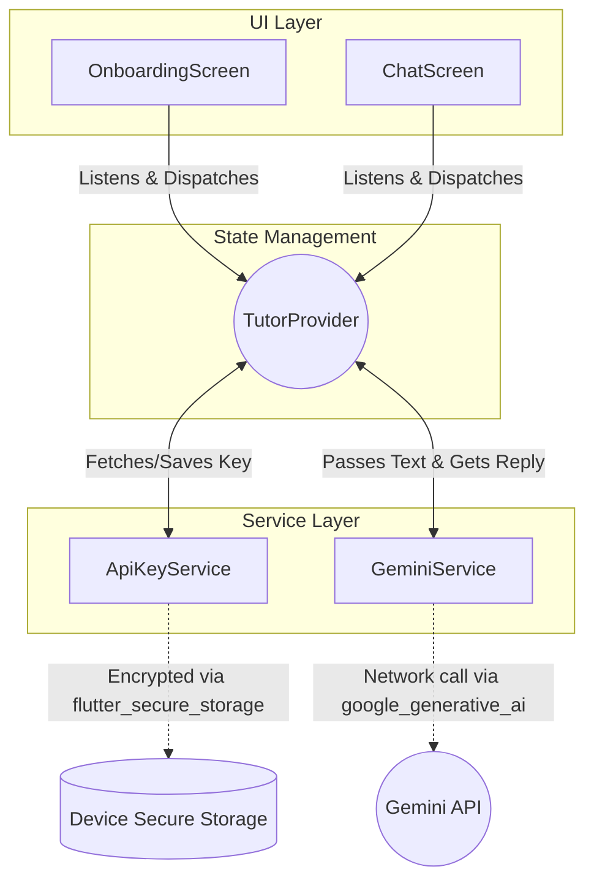
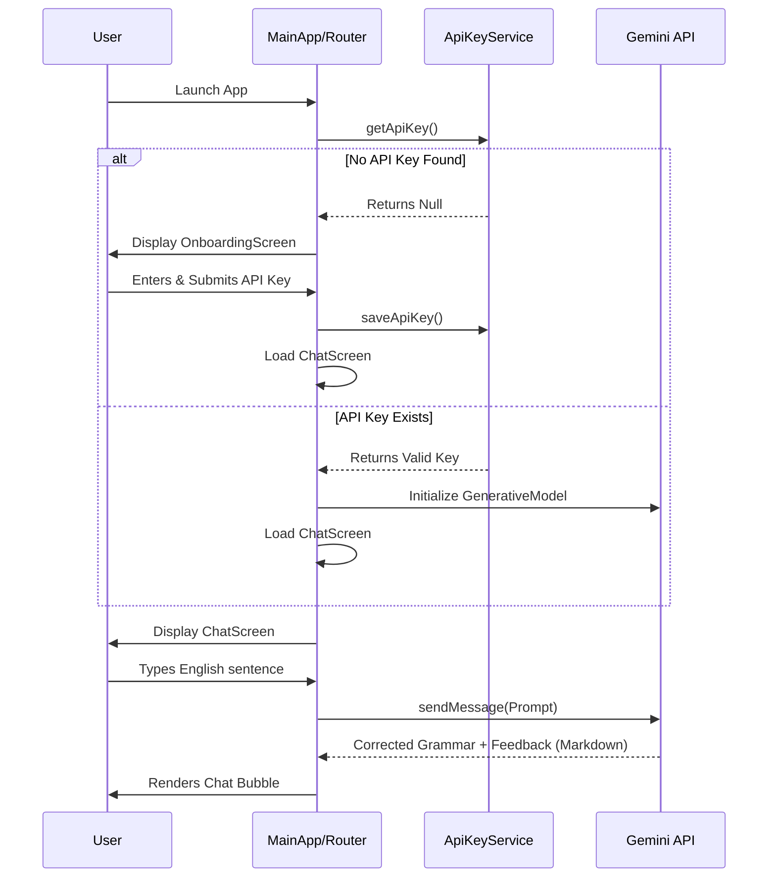

# AI English Tutor: Design & Architecture

## Overview
This document outlines the architecture, design choices, and implementation details for the MVP of the AI English Tutor Android application. The app leverages the **Bring Your Own Key (BYOK)** model with Gemini 1.5 Flash models to provide users with an intelligent and interactive English tutor without requiring backend server processing.

## Architecture Structure

The application follows a clean layered architecture, primarily separating the UI, state management, and external service interactions.

### Directory Structure
```text
lib/
 ├── main.dart
 ├── providers/
 │   └── tutor_provider.dart      # State management (ChangeNotifier)
 ├── screens/
 │   ├── onboarding_screen.dart   # API Key input UI
 │   └── chat_screen.dart         # Main chat interface with Markdown support
 └── services/
     ├── api_key_service.dart     # Secure storage operations (Android Keystore)
     └── gemini_service.dart      # Gemini API communication module
```

### High-Level Architecture Diagram
The architecture is designed to decouple logic, making dependencies explicitly manageable via the `provider` state manager. 



## Core Components
1. **ApiKeyService**: Utilizes `flutter_secure_storage` which relies on the Android Keystore (or iOS Keychain) to safely persist the user's Gemini API key.
2. **GeminiService**: Initializes the `GenerativeModel` from the `google_generative_ai` SDK. A strict System Instruction is applied upon initialization to enforce the AI into an "English Tutor" persona.
3. **TutorProvider (`ChangeNotifier`)**: The single source of truth for the app's current state. It stores:
   - The chat message history (`List<ChatMessage>`).
   - The loading status when waiting for Gemini.
   - The presence of the API key to dynamically route the user.
4. **Onboarding & Chat Screens**: Reactive boundaries that only rebuild when changes happen to the `TutorProvider`. The `ChatScreen` supports `flutter_markdown` so that Gemini's rich text responses are properly rendered.

## User Journey / Data Flow Diagram

The following sequence diagram represents the typical application flow, from launching the app to receiving an AI response.



## Application Details
### System Instructions (The Tutor Prompt)
The core logic for defining how the AI acts is hard-coded into the service layer:
> *"You are a strict but encouraging English tutor. Your goal is to help the user improve their English. If the user makes grammar or vocabulary mistakes, correct them gently and explain why. Keep your responses engaging and ask follow-up questions to keep the conversation going."*
